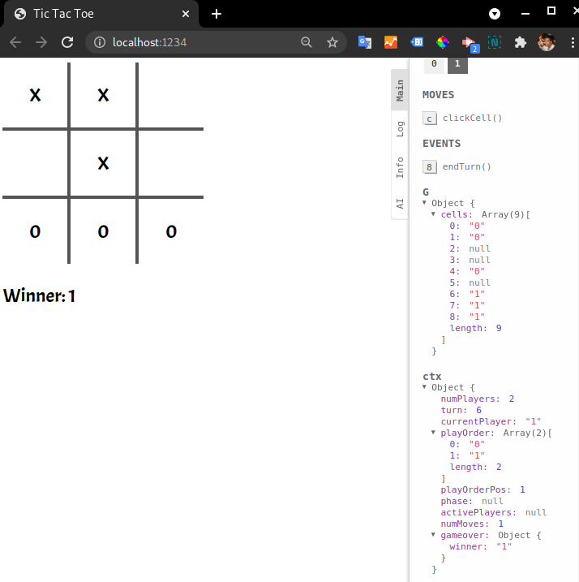

# TIC TAC TOE (boardgame.io)

Faz tempo estou querendo brincar com algo relacionado a games. Então encontrei esse framework e estou testando. Iniciei fazendo o tutorial deles com o TIC TAC TOE. Nosso famoso jogo da VELHA.

Até o momento estou gostando da estrutura e das featureas. Esse é um framework para jogos baseados em turnos. Onde cada jogador faz uma joagada de cada vez e espera sua vez de jogar. 

Pretendo continuar utilizando o exemplo do tutorial para testar as outras features do framework. E durante o processo, vou comentando aqui no repositório.

